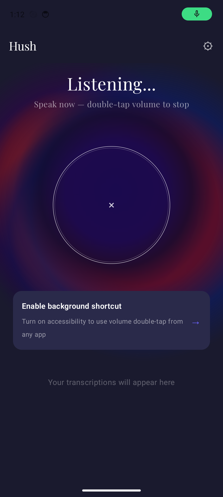
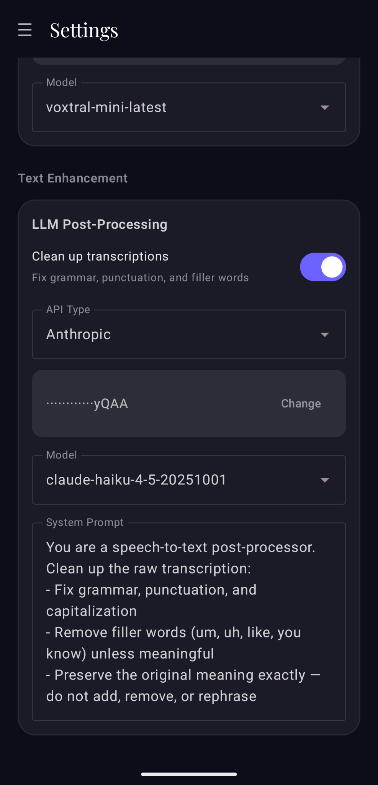

# Hush!

[](LICENSE)

Android AI dictation app — speak anywhere, transcribe instantly. A native alternative to Wispr Flow.

<p align="center">
  
  &nbsp;&nbsp;
  
</p>

## Features

- **Voice-to-text anywhere** — double-tap volume down to start/stop recording from any app
- **Auto-inject into text fields** — if a text field is focused, transcribed text is pasted directly at the cursor
- **Clipboard fallback** — text is always copied to clipboard, even when auto-inject is active
- **Background service** — persistent foreground notification with quick-action controls
- **Multi-provider transcription** — choose between Voxtral (Mistral), OpenAI Whisper, Groq, Local (on-device), or Moonshine (streaming)
- **Local on-device transcription** — Whisper tiny.en via ExecuTorch, no internet required
- **Moonshine streaming** — real-time on-device transcription via Moonshine SDK, live text as you speak
- **Streaming overlay** — floating overlay shows live transcription text in external apps, single paste on stop
- **Settings screen** — switch providers, configure API keys and models per provider
- **LLM post-processing** — optional AI cleanup of transcriptions (grammar, punctuation, formatting) via Anthropic or any OpenAI-compatible API
- **Custom blob/ring UI** — dark theme with animated glowing blobs and minimal ring-based mic button
- **Transcription history** — recent transcriptions stored locally with tap-to-copy
- **Usage dashboard** — streak tracking, transcription stats, weekly activity charts, cost estimates

## Setup Guide / Einrichtung

### English

#### Step 1: Get an API key

Get a key from your preferred transcription provider:

- **Voxtral (Mistral):** [console.mistral.ai](https://console.mistral.ai/) → API Keys
- **OpenAI Whisper:** [platform.openai.com](https://platform.openai.com/) → API Keys
- **Groq:** [console.groq.com](https://console.groq.com/) → API Keys

#### Step 2: Install Hush

Hush is not on the Play Store yet — you install it directly from a file (this is called "sideloading" and is totally safe).

1. On your Android phone, go to the [Releases page](https://github.com/leonbubova/hush-app/releases/latest) and download the `.apk` file
2. Open the downloaded file — Android will ask if you want to install from this source, tap **Allow** (you only need to do this once)
3. Tap **Install**, then **Open**
4. Hush will ask for microphone and notification permissions — grant both

#### Step 3: Configure your provider

1. Open the drawer (hamburger menu) and tap **Settings**
2. Select your transcription provider
3. Paste your API key and tap **Save**

#### Step 4: Enable the accessibility service

1. Tap the "Enable background shortcut" banner in the app
2. This opens Android's accessibility settings
3. Find **Hush** in the list and enable it
4. Confirm the permission dialog

#### Step 5: Start dictating

- **In the app:** tap the ring to start/stop recording
- **From anywhere:** double-tap volume down to start, double-tap again to stop
- Transcribed text is automatically pasted into the focused text field, or copied to clipboard

---

### Deutsch

#### Schritt 1: API-Key erstellen

Erstelle einen Key bei deinem bevorzugten Anbieter:

- **Voxtral (Mistral):** [console.mistral.ai](https://console.mistral.ai/) → API Keys
- **OpenAI Whisper:** [platform.openai.com](https://platform.openai.com/) → API Keys
- **Groq:** [console.groq.com](https://console.groq.com/) → API Keys

#### Schritt 2: Hush installieren

Hush ist noch nicht im Play Store — du installierst die App direkt als Datei (nennt sich "Sideloading", ist völlig sicher).

1. Oeffne auf deinem Android-Handy die [Releases-Seite](https://github.com/leonbubova/hush-app/releases/latest) und lade die `.apk`-Datei herunter
2. Oeffne die heruntergeladene Datei — Android fragt, ob du aus dieser Quelle installieren moechtest, tippe auf **Zulassen** (nur beim ersten Mal noetig)
3. Tippe auf **Installieren**, dann auf **Oeffnen**
4. Hush fragt nach Mikrofon- und Benachrichtigungsrechten — beides erlauben

#### Schritt 3: Anbieter konfigurieren

1. Oeffne das Menue (Hamburger-Symbol) und tippe auf **Settings**
2. Waehle deinen Transkriptions-Anbieter
3. Fuege deinen API-Key ein und tippe auf **Save**

#### Schritt 4: Bedienungshilfe aktivieren

1. Tippe auf das Banner "Enable background shortcut" in der App
2. Es oeffnen sich die Android-Bedienungshilfe-Einstellungen
3. Finde **Hush** in der Liste und aktiviere es
4. Bestaetige den Berechtigungsdialog

#### Schritt 5: Diktieren

- **In der App:** Tippe auf den Ring um die Aufnahme zu starten/stoppen
- **Von ueberall:** Doppelt auf Leiser-Taste druecken zum Starten, nochmal doppelt zum Stoppen
- Der transkribierte Text wird automatisch in das aktive Textfeld eingefuegt oder in die Zwischenablage kopiert

## Architecture

```
MainActivity          — Jetpack Compose UI, permissions, navigation
MainViewModel         — state management, service binding, provider config
DictationService      — foreground service, recording orchestration, clipboard + broadcast
HushAccessibilityService — volume key interception, auto-inject via ACTION_PASTE
AudioRecorder         — MediaRecorder wrapper for audio capture
SettingsScreen        — provider selection and per-provider configuration UI
HushApp               — Application class, notification channel setup
UsageScreen           — Compose usage dashboard (streak, charts, heatmap, cost)
UsageRepository       — session persistence (SharedPreferences + JSON)
HistoryRepository     — transcription history persistence (EncryptedSharedPreferences + JSON)
TestTags              — central registry of Compose testTag constants

transcription/
  TranscriptionProvider — interface for all transcription backends
  TranscribeResult      — sealed class: Success(text) | Error(code, message)
  ProviderConfig        — sealed config hierarchy (Voxtral, OpenAI, Groq, Local, Moonshine)
  ProviderRepository    — encrypted persistence + legacy API key migration
  ProviderFactory       — resolves active provider from config (isStreaming() check for Moonshine)
  VoxtralProvider       — Mistral Voxtral API client
  OpenAiWhisperProvider — OpenAI Whisper API client
  GroqProvider          — Groq API client (OpenAI-compatible)
  LocalProvider         — on-device inference via ExecuTorch (encoder-decoder pipeline)
  AudioConverter        — M4A/AAC → 16kHz mono float PCM conversion
  MelSpectrogram        — 80-channel log-mel spectrogram (N_FFT=400, hop=160, 3000 frames)
  WhisperTokenizer      — BPE token ID → text decoding (50k vocab from assets)
  ModelManager          — model download, storage, and lifecycle management
  MoonshineProvider     — streaming on-device transcription via Moonshine SDK
  StreamingOverlayManager — floating TYPE_ACCESSIBILITY_OVERLAY for live streaming text in external apps
  PostProcessorConfig   — configuration for LLM post-processing (API type, key, model, prompt)
  TextPostProcessor     — LLM-based transcription cleanup via Anthropic or OpenAI-compatible APIs
```

### Auto-inject flow

```
DictationService.stopRecording()
  → ProviderFactory.resolve(context) → provider.transcribe(file)
  → copyToClipboard(text)
  → sendBroadcast(ACTION_INJECT_TEXT)
  → HushAccessibilityService receives broadcast
  → findFocus(FOCUS_INPUT)
  → if found: performAction(ACTION_PASTE)
  → if not found: no-op (text already on clipboard)
```

### Streaming flow (Moonshine)

```
DictationService.startStreaming()
  → MoonshineProvider.start() → live callbacks (onLineTextChanged, onLineCompleted)
  → if external app: broadcast ACTION_OVERLAY_SHOW → StreamingOverlayManager shows live text
  → on stop: copyToClipboard(finalText)
  → broadcast ACTION_OVERLAY_DISMISS → dismiss overlay
  → delayed broadcast ACTION_INJECT_TEXT → ACTION_PASTE (single paste)
```

## Tech stack

- Kotlin + Jetpack Compose
- Android AccessibilityService for global hotkey + text injection
- Multi-provider transcription: Voxtral (Mistral), OpenAI Whisper, Groq, Local (on-device)
- ExecuTorch for on-device ML inference (Whisper tiny.en)
- OkHttp for API calls
- EncryptedSharedPreferences for secure credential storage
- Moonshine SDK (`ai.moonshine:moonshine-voice`) for streaming on-device transcription
- LLM post-processing via Anthropic Messages API or OpenAI-compatible Chat Completions API
- Coroutines for async transcription

## Compatibility

- Android 8.0 (Oreo) and up — minSdk 26
- Tested on Pixel 9 Pro (Android 15)

## Building

Requires JDK 17 and Android SDK (no Android Studio needed):

```bash
# Set environment (adjust paths for your system)
export JAVA_HOME=/path/to/jdk17        # e.g. /opt/homebrew/opt/openjdk@17 (macOS)
export ANDROID_HOME=/path/to/android-sdk # e.g. ~/Android/Sdk (Linux), /opt/homebrew/share/android-commandlinetools (macOS)

# Debug build (com.hush.app.debug — "Hush Dev")
./gradlew assembleDebug

# Release build (com.hush.app — "Hush", requires signing config)
./gradlew assembleRelease
```

### Debug vs Release builds

Debug builds use a separate application ID (`com.hush.app.debug`) and app name ("Hush Dev"), so they can be installed side-by-side with the release build on the same device. This prevents a broken dev build from replacing the stable production app.

| | Debug | Release |
|---|---|---|
| Package | `com.hush.app.debug` | `com.hush.app` |
| App name | Hush Dev | Hush |
| Signing | debug keystore | release keystore |

For release builds, add to `local.properties` (not committed to git):

```
RELEASE_STORE_FILE=/path/to/keystore
RELEASE_STORE_PASSWORD=your-password
RELEASE_KEY_ALIAS=your-alias
RELEASE_KEY_PASSWORD=your-password
```

Install on device:

```bash
# Debug (arm64 ABI split)
adb install -r app/build/outputs/apk/debug/app-arm64-v8a-debug.apk

# Release
adb install -r app/build/outputs/apk/release/app-release.apk
```

## Permissions

- `RECORD_AUDIO` — microphone access for dictation
- `INTERNET` — sending audio to transcription API
- `FOREGROUND_SERVICE` / `FOREGROUND_SERVICE_MICROPHONE` — background recording
- `POST_NOTIFICATIONS` — status notification
- Accessibility Service — volume key detection + text field injection

## Local (On-Device) Transcription

Hush supports local on-device transcription using ExecuTorch with Whisper models. No internet or API keys required.

### Supported models

| Model | Size | Latency (30s audio, flagship) | Quality |
|---|---|---|---|
| Whisper tiny.en | ~77 MB | ~1-2s | ~3-5% WER on clean speech |

### Exporting the Whisper model

Models are exported using [`optimum-executorch`](https://github.com/huggingface/optimum-executorch) with 3 quantization variants (INT4, INT8, FP32). See the [hush-app-models](https://github.com/leonbubova/hush-app-models) repo for export scripts and pre-built models.

### Using local transcription

1. Open Settings → select "Local (On-Device)"
2. Download the Whisper model (one-time, ~77 MB)
3. Start dictating — works fully offline

## Testing

### Unit tests (no device needed)

```bash
./gradlew testDebugUnitTest
```

| Suite | Tests | Coverage |
|---|---|---|
| `VoxtralApiTest` | 12 | HTTP responses, auth, multipart, real audio upload |
| `OpenAiWhisperProviderTest` | 11 | Same + language param handling |
| `GroqProviderTest` | 11 | HTTP responses, auth, multipart |
| `ProviderConfigTest` | 14 | JSON round-trip, defaults, edge cases |
| `ProviderFactoryTest` | 9 | Provider resolution, display names, fallback, local provider |
| `AudioConverterTest` | 10 | Resampling math, stereo→mono, Int16→Float32, normalization |
| `LocalProviderTest` | 6 | Model not downloaded errors, metadata, requiresNetwork=false |
| `ModelManagerTest` | 10 | Model status, file paths, download/delete, available models |
| `UsageRepositoryTest` | 8 | Record/load/clear, MAX_SESSIONS cap, malformed JSON |
| `HistoryRepositoryTest` | 6 | Add/load/clear, prepend order, blank text no-op, accumulation |
| `MelSpectrogramTest` | 12 | Output shape, Hann window, mel filterbank, sine wave energy, log scaling |
| `WhisperTokenizerTest` | 12 | BPE decoding, EOS/special token filtering, vocab loading, known phrases |
| `MainViewModelTest` | 22 | Init state, navigation, provider management, history, usage, service toggle |
| `ProviderRepositoryTest` | 10 | Active provider, config roundtrip, migration, malformed JSON, all configs |
| `PostProcessorConfigTest` | 5 | Default values, JSON round-trip, missing fields, empty JSON |
| `TextPostProcessorTest` | 14 | MockWebServer: Anthropic/OpenAI success, headers, errors, fallback, trimming |

### Instrumented tests (emulator needed)

```bash
ANDROID_SERIAL=emulator-5554 ./gradlew :app:connectedDebugAndroidTest
```

| Suite | Tests | Coverage |
|---|---|---|
| `HomeScreenStateTest` | 10 | All 5 dictation states, history items, empty history, accessibility banner, mic button |
| `NavigationTest` | 8 | Drawer open/close, navigate to Settings/Usage/Home via drawer |
| `SettingsScreenTest` | 6 | Provider options, default selection, Local model UI, API key field, save button |
| `DictationFlowE2ETest` | 5 | Fresh-install record→error flow, empty history, mic button, drawer button, accessibility |
| `SettingsFlowE2ETest` | 4 | Switch providers, Local shows download, persist selection across navigation |
| `AudioConverterInstrumentedTest` | 3 | M4A decode to 16kHz mono PCM, normalized range, non-silent output |
| `TranscriptionE2ETest` | 6 | Real audio-to-API transcription (skipped if API key not set) |

All UI tests use Compose `testTag` semantics via `TestTags.kt` — no coordinate tapping or UIAutomator XML dumps.

#### TranscriptionE2ETest

Real audio-to-API transcription tests (skipped if API key not set):

- Sends `test_audio.m4a` ("Hello this is a test for end to end testing") to each provider
- Asserts transcription contains expected words
- Keys are read from `local.properties` (gitignored):

```properties
TEST_VOXTRAL_KEY=your-key
TEST_OPENAI_KEY=your-key
TEST_GROQ_KEY=your-key
```

#### Prerequisites

- AVD named `hush-test` (Pixel 7 profile, 1080x2400 @ 420dpi, API 34)
- No prior install of `com.hush.app.debug` on the emulator (for DictationFlowE2ETest)

#### Environment setup

```bash
# Ensure JAVA_HOME and ANDROID_HOME are set (see Building section above)
EMU=$ANDROID_HOME/emulator/emulator
ADB=$ANDROID_HOME/platform-tools/adb
```

#### Running

```bash
# Start emulator (headless)
$EMU -avd hush-test -no-window -no-audio -no-snapshot-load -gpu host &
$ADB wait-for-device shell 'while [ "$(getprop sys.boot_completed)" != "1" ]; do sleep 1; done'

# Clean state for DictationFlowE2ETest
$ADB -s emulator-5554 uninstall com.hush.app.debug || true

# Run all instrumented tests
ANDROID_SERIAL=emulator-5554 ./gradlew :app:connectedDebugAndroidTest

# Pull screenshots
$ADB -s emulator-5554 pull /sdcard/Pictures/hush-tests/ screenshots/
```

## AI-Assisted Development

This project is developed with [Claude Code](https://claude.ai/claude-code). The repo includes dev tooling for emulator-based UI verification.

### Emulator helper (`scripts/emu.sh`)

A shell script that wraps all ADB interactions into single commands — navigation, tapping by visible text, screenshots, log inspection. Eliminates raw ADB boilerplate and multi-step `uiautomator dump` → `grep bounds` → `tap` workflows.

```bash
scripts/emu.sh build              # build + install on emulator
scripts/emu.sh launch             # start app
scripts/emu.sh nav settings       # open drawer → tap Settings
scripts/emu.sh tap "Button Text"  # find element by text → tap (auto-scrolls if off-screen)
scripts/emu.sh screenshot name    # save to dev-screenshots/
scripts/emu.sh dump               # show visible text elements
scripts/emu.sh logcat             # recent app errors
scripts/emu.sh help               # full command list
```

The script lives in `scripts/` (gitignored — contains device-specific paths). It is self-maintaining: when commands break due to UI changes, they should be fixed in-place. See `.claude/rules/emulator.md` for the full reference and maintenance rules.

## Security

- API keys are stored in Android EncryptedSharedPreferences (AES-256)
- No credentials are included in the APK — each user provides their own API key
- Legacy Voxtral API keys are auto-migrated to the new provider config system
- Release keystore and passwords are kept in `local.properties` (gitignored)
- Test API keys are passed via `local.properties` instrumentation args (never in source)
- Full credential audit performed 2026-02-24: no API keys, passwords, or secrets in codebase or git history
